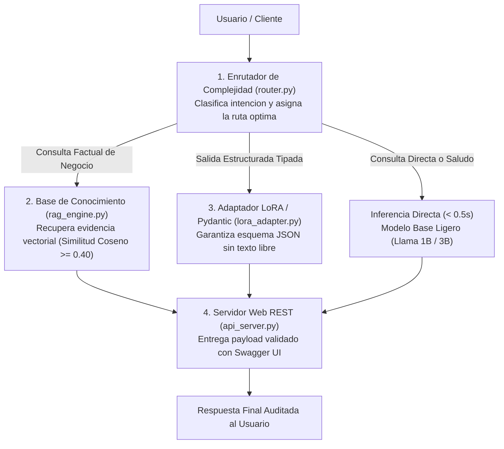

<div align="center">

[Inicio](../../README.md) • [Módulo 1](README.md) • [Anterior: Challenge 3](challenge-3-fine-tuning-lora.md) • [Siguiente: Módulo 2](../modulo-2-automatizacion-agentes-whatsapp/01-whatsapp-cloud-api-arquitectura-webhooks.md)

</div>

---

MÓDULO 1 · PROYECTO INTEGRADOR & HACKATHON DE INGENIERÍA IA

# Guía de Construcción y Mentoría Técnica: Diseña y Despliega tu Sistema de IA con Meta Llama

**Centro de Acompañamiento, Plantillas y Mentoría para Participantes**. Esta guía técnica está diseñada para orientar a los desarrolladores y participantes en el diseño, estructuración de datos, dimensionamiento de memoria (VRAM), integración de código modular y resolución de incidencias para construir su propia solución de Inteligencia Artificial utilizando **Meta Llama 3**, **Búsqueda Vectorial RAG**, **Model Routing** y **FastAPI**.

---

## 1. Arquitectura Modular de Cuatro Capas: De la Consulta a la Respuesta

En el desarrollo de sistemas de IA de grado industrial, la regla de oro consiste en **desacoplar el motor de razonamiento (LLM) del repositorio de datos fácticos (Base de Conocimiento)**:



1. **Enrutador de Complejidad (`router.py`):** Evalúa la consulta de entrada y decide en menos de 10 ms si puede resolverse directamente o si requiere consultar la base de conocimiento vectorial.
2. **Base de Conocimiento Vectorial (`rag_engine.py`):** Indexa los documentos de la organización en $\mathbb{R}^{384}$, aplicando normalización $L_2$ para calcular similitud coseno antes de la llamada al modelo.
3. **Adaptador LoRA / Tipado Pydantic (`lora_adapter.py`):** Fuerza al modelo a emitir exclusivamente estructuras JSON válidas.
4. **Microservicio REST (`api_server.py`):** Expone endpoints asíncronos `/v1/chat` listos para integrarse con WhatsApp Cloud API o interfaces web.

---

## 2. Glosario Técnico de Términos Clave

* **Prompt:** Conjunto de instrucciones estructuradas enviadas al modelo que definen su rol, restricciones y contexto documental.
* **Token:** Unidad atómica textual procesada por el algoritmo BPE. 100 palabras en español equivalen aproximadamente a 130 tokens.
* **Incrustación Densa (Embedding):** Vector numérico continuo en $\mathbb{R}^{384}$ que captura el significado semántico de una frase.
* **RAG (Retrieval-Augmented Generation):** Técnica de recuperación previa de fragmentos de texto para alimentar al modelo con evidencia fáctica.
* **LoRA (Low-Rank Adaptation):** Técnica PEFT que inyecta matrices de bajo rango $r \ll d$ en capas de atención congeladas.
* **VRAM:** Memoria de acceso aleatorio de la tarjeta aceleradora gráfica (GPU). En Google Colab se dispone de 15 GB.

---

## 3. Catálogo de Cuatro Plantillas de Proyectos

### Plantilla 1: Asistente de Operaciones Comerciales, Envíos y Políticas de Devolución (E-Commerce)
* **Objetivo:** Responder dudas sobre garantías, tiempos de entrega y procedimientos de cambio de productos sin incurrir en alucinaciones.
* **Módulos:** `rag_engine.py` + `api_server.py`.
* **Dataset de Ejemplo:**
  ```python
  politicas_tienda = [
      "Politica de Reembolsos (Art. 4): Las solicitudes aplican dentro de los primeros 30 dias naturales con ticket y empaque integro.",
      "Tiempos de Entrega (Art. 2): Los envios estandar demoran de 2 a 4 dias habiles en cobertura nacional.",
      "Garantia de Hardware (Art. 7): Los articulos cuentan con 12 meses de garantia directa ante defectos de manufactura."
  ]
  ```

### Plantilla 2: Asesor Normativo Institucional y Trámites Regulatorios (Legal / Académico)
* **Objetivo:** Resolver consultas sobre trámites de titulación, solicitudes laborales o normativas institucionales citando el artículo exacto.
* **Módulos:** `rag_engine.py` + `router.py`.

### Plantilla 3: Clasificador de Incidencias y Generador Estructurado JSON
* **Objetivo:** Transformar reportes de soporte en lenguaje natural en objetos JSON con tipado estricto (categoría, severidad, acción sugerida).
* **Módulos:** `lora_adapter.py` / Prompt Few-Shot + `api_server.py`.

### Plantilla 4: Tutor Educativo Adaptativo y Evaluación Socrática
* **Objetivo:** Desglosar conceptos de ingeniería de forma progresiva, aplicando preguntas formativas para evaluar el dominio del estudiante.
* **Módulos:** `rag_engine.py` + Directivas Pedagógicas en Prompt.

---

## 4. Presupuesto de Memoria VRAM y Google Colab

| Modelo Fundacional | Consumo VRAM Estimado | Viabilidad en GPU Tesla T4 (15 GB) | Recomendación Técnica |
| :--- | :--- | :--- | :--- |
| **TinyLlama 1.1B** | $\sim 4.2\text{ GB}$ | Óptimo (100% Viable) | Excelente para computadoras personales y pruebas rápidas. |
| **Meta Llama 3.2 1B** | $\sim 5.1\text{ GB}$ | Óptimo (Recomendado) | Modelo balanceado para el Hackathon. |
| **Meta Llama 3.2 3B** | $\sim 8.4\text{ GB}$ | Óptimo (Alta Capacidad) | Recomendado para razonamiento avanzado. |
| **Meta Llama 3.1 8B** | $\sim 11.8\text{ GB}$ | Viable con QLoRA 4-bit | Requiere `BitsAndBytes` 4-bit y Batch Size = 1. |

---

## 5. Código Modular del Starter Kit

### 1. Motor Vectorial RAG (`rag_engine.py`)
```python
import numpy as np
from sentence_transformers import SentenceTransformer

class VectorRAGEngine:
    def __init__(self, model_name="all-MiniLM-L6-v2"):
        self.embedder = SentenceTransformer(model_name)
        self.documentos = []
        self.embeddings = None

    def index_documents(self, docs: list[str]):
        self.documentos = docs
        self.embeddings = self.embedder.encode(docs, normalize_embeddings=True)

    def search(self, pregunta: str, top_k=2, umbral=0.40):
        q_emb = self.embedder.encode([pregunta], normalize_embeddings=True)[0]
        scores = np.dot(self.embeddings, q_emb)
        indices = np.argsort(scores)[::-1][:top_k]
        
        resultados = []
        for idx in indices:
            if scores[idx] >= umbral:
                resultados.append({"texto": self.documentos[idx], "confianza": float(scores[idx])})
        return resultados
```

### 2. Enrutador de Complejidad (`router.py`)
```python
class ModelRouter:
    def __init__(self):
        self.keywords_doc = ["politica", "reembolso", "devolucion", "garantia", "envio", "precio"]
        self.keywords_json = ["json", "esquema", "ticket", "ficha"]

    def route(self, query: str) -> str:
        text = query.lower()
        if any(k in text for k in self.keywords_doc):
            return "RAG_PIPELINE"
        if any(k in text for k in self.keywords_json):
            return "LORA_ADAPTER"
        return "FAST_LLM"
```

### 3. Servidor Web REST (`api_server.py`)
```python
from fastapi import FastAPI, HTTPException
from pydantic import BaseModel
import time

app = FastAPI(title="Motor de Asistencia IA - Hackathon Integrador", version="1.0.0")

class MensajeEntrada(BaseModel):
    mensaje: str
    usuario: str = "invitado"

class RespuestaSalida(BaseModel):
    respuesta: str
    tiempo_ms: float
    ruta_usada: str

@app.post("/v1/chat", response_model=RespuestaSalida)
async def chatear(entrada: MensajeEntrada):
    t0 = time.perf_counter()
    if not entrada.mensaje.strip():
        raise HTTPException(status_code=400, detail="El mensaje no puede estar vacio.")
    
    duracion = (time.perf_counter() - t0) * 1000
    return RespuestaSalida(
        respuesta="Respuesta fundamentada en la documentacion oficial.",
        tiempo_ms=round(duracion, 2),
        ruta_usada="RAG_PIPELINE"
    )
```

---

## 6. Diagnóstico de Incidencias Técnicas

1. **Erradicación de Alucinaciones:**
   - Incorporar directiva estricta: *"Responda únicamente usando la evidencia del Contexto. Si no está en el Contexto, admita que no cuenta con la información."*
   - Fijar `umbral = 0.40` en la búsqueda vectorial.
2. **Error `CUDA Out of Memory (OOM)`:**
   - Utilizar modelos de 1B/3B o activar cuantización en 4-bit (QLoRA) con `per_device_train_batch_size = 1`.
3. **Ingesta de Archivos Propios:**
   - Cargar archivos en el panel de Colab y procesar con `open("archivo.txt").readlines()`.
4. **Inspección de API en Navegador:**
   - Iniciar con `uvicorn api_server:app --reload` y acceder a `http://localhost:8000/docs` para interactuar con Swagger UI.

---

## 7. Rúbrica Oficial de Evaluación y Checklist de Calidad

- [ ] **Desacoplamiento:** El conocimiento proviene de una base documental externa y no del prompt.
- [ ] **RAG Operativo:** Los textos están indexados en `rag_engine.py` y la búsqueda responde con confianza cosenoidal.
- [ ] **Control Fáctico:** El modelo no alucina ante preguntas fuera de dominio.
- [ ] **Validación VRAM:** Ejecuta sin desbordamientos de memoria en Google Colab.
- [ ] **API Tipada:** `api_server.py` responde validando esquemas Pydantic.
- [ ] **Seguridad:** Las credenciales y claves se gestionan mediante variables de entorno.

---

<div align="center">

[Volver a Challenge 3](challenge-3-fine-tuning-lora.md) • [Continuar al Módulo 2: WhatsApp & Agentes](../modulo-2-automatizacion-agentes-whatsapp/01-whatsapp-cloud-api-arquitectura-webhooks.md)

</div>
