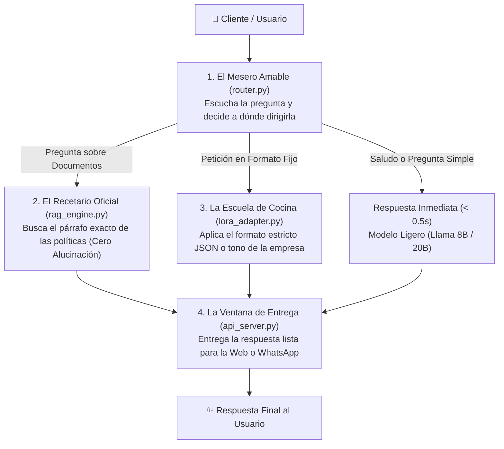

<div align="center">

[🏠 Inicio](../../README.md) • [📁 Módulo 1](README.md) • [⬅️ Anterior (Challenge 3)](challenge-3-fine-tuning-lora.md) • [Siguiente ➡️](../modulo-2-automatizacion-agentes-whatsapp/01-whatsapp-cloud-api-arquitectura-webhooks.md)

</div>

---

MÓDULO 1 · PROYECTO INTEGRADOR & HACKATHON DE INGENIERÍA IA

# Guía Paso a Paso del Proyecto Integrador: Construye tu Sistema de IA

**Centro de Acompañamiento, Plantillas y Mentoría para Participantes**. Esta guía está diseñada para que cualquier persona, sin importar su nivel de experiencia previa, pueda concebir, armar y probar su propia solución de Inteligencia Artificial utilizando **Meta Llama 3**, **Búsqueda Vectorial RAG**, **Model Routing** y **FastAPI**.

---

## 🍽️ 1. ¿Cómo Funciona tu Sistema de IA? La Analogía del Restaurante

Para construir tu proyecto no necesitas memorizar fórmulas matemáticas complejas. Imagina que tu sistema inteligente es como un **Restaurante Gourmet**:



1. **El Mesero (`router.py`):** Escucha la frase del usuario. Si es un saludo común, responde de inmediato. Si preguntan por una política o garantía, va a consultar la libreta de la empresa.
2. **El Menú y Recetario (`rag_engine.py`):** Es la libreta con las políticas oficiales. Se consulta la información real antes de responder para **evitar inventar datos**.
3. **La Escuela de Cocina (`lora_adapter.py`):** El entrenamiento especial para que el modelo siempre entregue respuestas con el estilo de la marca o en formato estructurado (JSON).
4. **La Ventana de Servicio (`api_server.py`):** El mostrador donde WhatsApp o cualquier página web pide y recibe la respuesta terminada.

---

## 📚 2. Glosario Fácil: La IA Explicada con Peras y Manzanas

* **Prompt:** La instrucción o pregunta que le escribes a la IA.
* **Token:** Los fragmentos en los que la IA divide las palabras (como sílabas). 100 palabras $\approx$ 130 tokens.
* **Embedding:** La "huella digital" del significado de una frase para buscar ideas similares.
* **RAG (Recuperación):** Hacer un **examen a libro abierto**: la IA lee tus documentos antes de responder.
* **LoRA (Adaptación):** Ponerle unas gafas especializadas a la IA para que aprenda un formato sin reescribir todo su cerebro.
* **VRAM:** La memoria rápida de la tarjeta de video (GPU). En Google Colab tienes 15 GB gratis.

---

## 🚀 3. Cuatro Plantillas de Proyectos Listas para Elegir

Elige la que más te guste para tu entrega:

### 🛍️ Plantilla A: Asistente de Atención al Cliente & Devoluciones (E-Commerce)
* **Objetivo:** Responder dudas sobre garantías, tiempos de entrega y cambios de productos sin inventar información.
* **Archivos a usar:** `rag_engine.py` + `api_server.py`.
* **Datos de prueba:**
  ```python
  politicas_tienda = [
      "Los reembolsos se procesan en un maximo de 30 dias con ticket de compra original.",
      "Los envios a todo el pais tardan de 2 a 4 dias habiles en llegar a tu domicilio.",
      "Todos los productos electronicos tienen 1 ano de garantia ante fallas de fabrica."
  ]
  ```

### ⚖️ Plantilla B: Asesor de Reglamentos y Trámites (Escuelas / Empresas)
* **Objetivo:** Resolver dudas sobre trámites de titulación, solicitudes de vacaciones o estatutos institucionales citando el número de artículo.
* **Archivos a usar:** `rag_engine.py` + `router.py`.

### 📊 Plantilla C: Clasificador de Soporte y Generador de JSON
* **Objetivo:** Recibir quejas de usuarios y convertirlas automáticamente en fichas estructuradas en JSON (categoría, urgencia y resumen).
* **Archivos a usar:** `lora_adapter.py` / Prompt Few-Shot + `api_server.py`.

### 🎓 Plantilla D: Tutor de Estudio Personalizado
* **Objetivo:** Explicar temas difíciles de manera sencilla y hacer preguntas de opción múltiple al estudiante para evaluar su aprendizaje.
* **Archivos a usar:** `rag_engine.py` + Prompt de Profesor Paciente.

---

## 🚦 4. Semáforo de Hardware & Google Colab Gratuito

| Modelo de IA | Memoria Requerida | Estado en Google Colab T4 (15 GB) | Recomendación |
| :--- | :--- | :--- | :--- |
| **TinyLlama 1.1B** | $\sim 4.2\text{ GB}$ | 🟢 **100% Viable y Súper Ligero** | Ideal para computadoras portátiles y pruebas rápidas. |
| **Meta Llama 3.2 1B** | $\sim 5.1\text{ GB}$ | 🟢 **Excelente Rendimiento** | La opción recomendada para el Hackathon. |
| **Meta Llama 3.2 3B** | $\sim 8.4\text{ GB}$ | 🟢 **Gran Capacidad Analítica** | Muy fluido en la GPU T4 de Colab. |
| **Meta Llama 3.1 8B** | $\sim 11.8\text{ GB}$ | 🟡 **Viable con QLoRA 4-bit** | Usar `BitsAndBytes` 4-bit y Batch Size = 1. |

---

## 🛠️ 5. Starter Kit: Código Modular Listo para Probar

### 1. El Buscador RAG (`rag_engine.py`)
```python
import numpy as np
from sentence_transformers import SentenceTransformer

class VectorRAGEngine:
    def __init__(self, model_name="all-MiniLM-L6-v2"):
        self.embedder = SentenceTransformer(model_name)
        self.documents = []
        self.embeddings = None

    def index_documents(self, docs: list[str]):
        self.documents = docs
        self.embeddings = self.embedder.encode(docs, normalize_embeddings=True)

    def search(self, pregunta: str, top_k=2, umbral=0.40):
        q_emb = self.embedder.encode([pregunta], normalize_embeddings=True)[0]
        scores = np.dot(self.embeddings, q_emb)
        indices = np.argsort(scores)[::-1][:top_k]
        
        resultados = []
        for idx in indices:
            if scores[idx] >= umbral:
                resultados.append({"texto": self.documents[idx], "confianza": float(scores[idx])})
        return resultados
```

### 2. El Mesero Inteligente (`router.py`)
```python
class ModelRouter:
    def __init__(self):
        self.keywords_doc = ["politica", "reembolso", "devolucion", "garantia", "envio", "precio"]
        self.keywords_json = ["json", "esquema", "ticket", "ficha"]

    def route(self, query: str) -> str:
        text = query.lower()
        if any(k in text for k in self.keywords_doc):
            return "RAG_PIPELINE"
        if any(k in text for k in self.keywords_json):
            return "LORA_ADAPTER"
        return "FAST_LLM"
```

### 3. El Servidor Web (`api_server.py`)
```python
from fastapi import FastAPI, HTTPException
from pydantic import BaseModel
import time

app = FastAPI(title="Mi Asistente de IA - Hackathon", version="1.0.0")

class MensajeEntrada(BaseModel):
    mensaje: str
    usuario: str = "invitado"

class RespuestaSalida(BaseModel):
    respuesta: str
    tiempo_ms: float
    fuente: str

@app.post("/v1/chat", response_model=RespuestaSalida)
async def chatear(entrada: MensajeEntrada):
    t0 = time.perf_counter()
    if not entrada.mensaje.strip():
        raise HTTPException(status_code=400, detail="Escribe un mensaje valido.")
    
    # Procesamiento con RAG o LLM
    duracion = (time.perf_counter() - t0) * 1000
    return RespuestaSalida(
        respuesta="Segun nuestras politicas oficiales: los reembolsos demoran 30 dias con ticket.",
        tiempo_ms=round(duracion, 2),
        fuente="Politicas_Oficiales_Art4"
    )
```

---

## 🩹 6. Primeros Auxilios: Solución a Tropiezos Frecuentes

1. **¿Cómo evito que la IA invente datos?**
   - Agrega en tu prompt: *"Responde únicamente con el texto del Contexto. Si no está en el Contexto, di 'No cuento con información oficial sobre este tema'."*
   - Fija `umbral = 0.40` en tu RAG.
2. **Error `CUDA Out of Memory` en Colab:**
   - Usa un modelo de 1B (ej. `TinyLlama-1.1B` o `Llama-3.2-1B`) o fija `per_device_train_batch_size = 1`.
3. **¿Cómo subir mis propios archivos?**
   - En Google Colab, arrastra tu archivo `.txt` al panel de archivos y léelo con `open("mi_archivo.txt").readlines()`.
4. **¿Cómo probar la API en el navegador?**
   - Inicia con `uvicorn api_server:app --reload` y abre `http://localhost:8000/docs` para ver Swagger UI.

---

## ✅ 7. Lista de Autoevaluación Pre-Entrega

- [ ] **Tema Elegido:** Seleccioné una plantilla o tema propio y redacté mis textos.
- [ ] **RAG Conectado:** Mis textos están indexados en `rag_engine.py`.
- [ ] **Sin Alucinaciones:** El modelo admite cuando no tiene la información.
- [ ] **Probado en Colab:** Corrí el cuaderno de Google Colab sin errores.
- [ ] **Servidor Listo:** `api_server.py` responde consultas en formato JSON.
- [ ] **Seguridad:** Los tokens se leen desde variables de entorno.

---

<div align="center">

[⬅️ Volver a Challenge 3](challenge-3-fine-tuning-lora.md) • [Continuar al Módulo 2: WhatsApp & Agentes ➡️](../modulo-2-automatizacion-agentes-whatsapp/01-whatsapp-cloud-api-arquitectura-webhooks.md)

</div>
