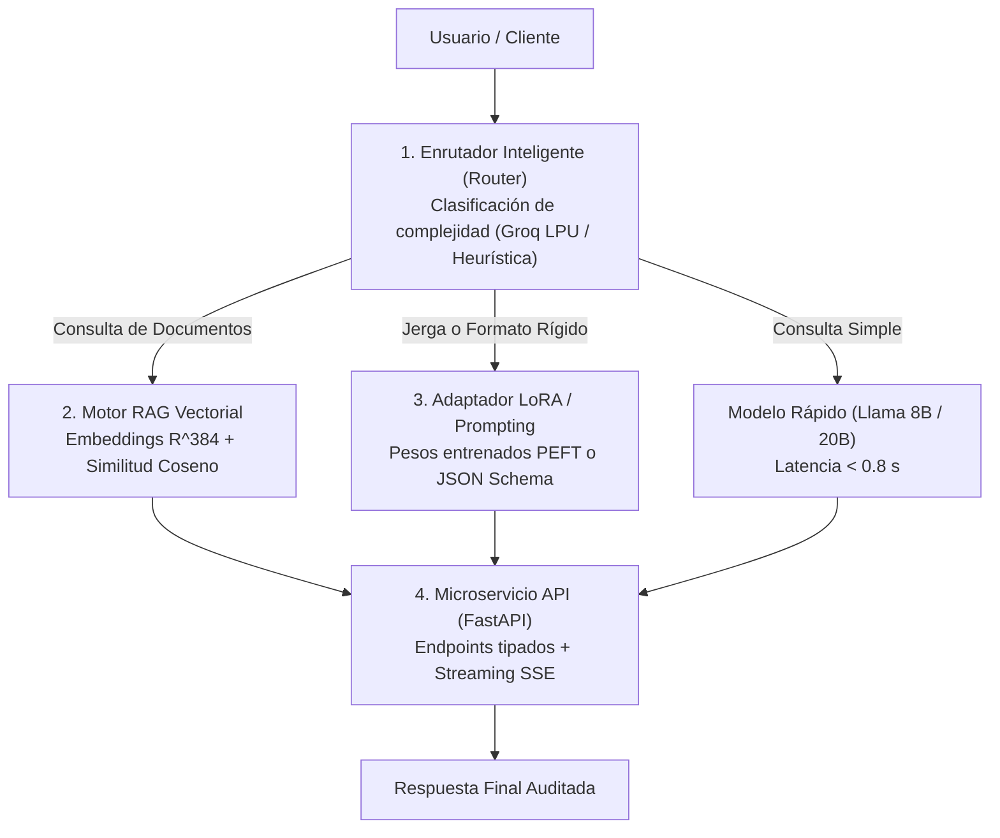

<div align="center">

[🏠 Inicio](../../README.md) • [📁 Módulo 1](README.md) • [⬅️ Anterior (Challenge 3)](challenge-3-fine-tuning-lora.md) • [Siguiente ➡️](../modulo-2-automatizacion-agentes-whatsapp/01-whatsapp-cloud-api-arquitectura-webhooks.md)

</div>

---

MÓDULO 1 · PROYECTO INTEGRADOR & HACKATHON DE INGENIERÍA IA

# Centro de Acompañamiento y Guía de Construcción: Proyecto Integrador

**Guía técnica activa para participantes y estudiantes**. Esta guía no es la presentación de un proyecto terminado, sino una **mesa de trabajo y asesoría técnica paso a paso** diseñada para orientarte en la concepción, selección de arquitectura, dimensionamiento de hardware (VRAM), integración de código y resolución de errores para construir tu propio sistema de IA antes de pasar al Módulo 2.

---

## 1. De la Idea a la Arquitectura: Las 4 Capas del Sistema

Cualquier sistema de IA aplicada de nivel industrial se compone de 4 capas modulares desacopladas:



---

## 2. Árbol de Decisiones: ¿Qué Tecnología Elegir para tu Idea?

| Si tu proyecto requiere... | Técnica Recomendada | Stack Tecnológico Sugerido | Bloque de Código |
| :--- | :--- | :--- | :--- |
| **Conocimiento dinámico**, políticas cambiantes o citas de manuales | **RAG Semántico** | `sentence-transformers`, Similitud Coseno, SQLite/Memoria | `rag_engine.py` |
| **Formato de salida estricto** (JSON Schema/SQL) o jerga médica/legal | **Fine-Tuning LoRA (PEFT)** | `peft`, `trl` (`SFTTrainer`), TinyLlama / Llama 3.2 1B | `lora_adapter.py` |
| **Ambos:** Políticas dinámicas + Formato estricto | **Arquitectura Híbrida (RAG + LoRA)** | RAG para hechos + LoRA para estructura | `rag_engine.py` + `lora_adapter.py` |
| **Gran volumen de preguntas simples** con algunas analíticas | **Model Router** | Groq LPU API + Llama 8B / 70B | `router.py` |

---

## 3. Dimensionamiento de Hardware & Memoria VRAM

Para ejecutar tu solución en **Google Colab Gratuito (1x GPU Tesla T4 de 15 GB VRAM)**:

1. **TinyLlama 1.1B / Llama 3.2 1B en FP16:**
   - Pesos base: $\sim 2.2\text{ GB}$.
   - Optimizador LoRA ($r=8, \alpha=16$): $\sim 9\text{ MB}$.
   - Memoria total requerida: **$\sim 4.5\text{ GB}$ (100% Viable en Colab y laptops con 8GB RAM)**.
2. **Meta Llama 3.1 8B con QLoRA 4-bit (NF4):**
   - Pesos cuantizados: $\sim 5.5\text{ GB}$.
   - Optimizador LoRA ($r=16$): $\sim 65\text{ MB}$.
   - Memoria total requerida: **$\sim 8.5\text{ GB}$ (Totalmente viable en Colab T4)**.
3. **Hiperparámetros Recomendados para Colab:**
   - `per_device_train_batch_size = 1` o `2`.
   - `gradient_accumulation_steps = 4`.
   - `learning_rate = 2e-4`.
   - `fp16 = True`.

---

## 4. Starter Kit Oficial: Bloques Aceleradores de Código

### Bloque 1: Enrutador de Consultas (`router.py`)
```python
class ModelRouter:
    """Clasifica la intencion de la consulta para optimizar latencia y costo."""
    def __init__(self):
        self.keywords_rag = ["politica", "reembolso", "garantia", "manual", "horario", "precio"]
        self.keywords_lora = ["json", "esquema", "diagnostico", "sql", "codigo"]

    def route(self, query: str) -> str:
        text = query.lower()
        if any(k in text for k in self.keywords_rag):
            return "RAG_PIPELINE"
        if any(k in text for k in self.keywords_lora):
            return "LORA_ADAPTER"
        return "FAST_LLM"
```

### Bloque 2: Motor RAG Vectorial (`rag_engine.py`)
```python
import numpy as np
from sentence_transformers import SentenceTransformer

class VectorRAGEngine:
    def __init__(self, model_name="all-MiniLM-L6-v2"):
        self.embedder = SentenceTransformer(model_name)
        self.documents = []
        self.embeddings = None

    def index_documents(self, docs: list[str]):
        self.documents = docs
        self.embeddings = self.embedder.encode(docs, normalize_embeddings=True)

    def search(self, query: str, top_k=2, threshold=0.40):
        q_emb = self.embedder.encode([query], normalize_embeddings=True)[0]
        scores = np.dot(self.embeddings, q_emb)
        indices = np.argsort(scores)[::-1][:top_k]
        
        results = []
        for idx in indices:
            if scores[idx] >= threshold:
                results.append({"text": self.documents[idx], "score": float(scores[idx])})
        return results
```

### Bloque 3: Adaptador LoRA (`lora_adapter.py`)
```python
import torch
from transformers import AutoModelForCausalLM, AutoTokenizer
from peft import PeftModel

class LoRAInferenceEngine:
    def __init__(self, base_model_id="TinyLlama/TinyLlama-1.1B-Chat-v1.0", adapter_path="./lora_checkpoint"):
        self.tokenizer = AutoTokenizer.from_pretrained(base_model_id)
        self.base_model = AutoModelForCausalLM.from_pretrained(
            base_model_id, 
            dtype=torch.float16 if torch.cuda.is_available() else torch.float32,
            device_map="auto"
        )
        try:
            self.model = PeftModel.from_pretrained(self.base_model, adapter_path)
        except Exception:
            self.model = self.base_model

    def generate(self, prompt: str, max_new_tokens=80) -> str:
        inputs = self.tokenizer(prompt, return_tensors="pt").to(self.model.device)
        with torch.no_grad():
            outputs = self.model.generate(**inputs, max_new_tokens=max_new_tokens, do_sample=False)
        new_tokens = outputs[0][inputs["input_ids"].shape[1]:]
        return self.tokenizer.decode(new_tokens, skip_special_tokens=True).strip()
```

### Bloque 4: Servidor FastAPI (`api_server.py`)
```python
from fastapi import FastAPI, HTTPException
from pydantic import BaseModel
import time

app = FastAPI(title="Motor de Asistencia IA Hackathon", version="1.0.0")

class ChatRequest(BaseModel):
    mensaje: str
    usuario_id: str = "usr_demo"

class ChatResponse(BaseModel):
    respuesta: str
    ruta_usada: str
    latencia_ms: float
    fuentes: list[str] = []

@app.post("/v1/chat", response_model=ChatResponse)
async def procesar_mensaje(req: ChatRequest):
    t0 = time.perf_counter()
    if not req.mensaje.strip():
        raise HTTPException(status_code=400, detail="El mensaje no puede estar vacio.")
    
    # Enrutamiento y procesamiento
    latencia = (time.perf_counter() - t0) * 1000
    return ChatResponse(
        respuesta="Respuesta procesada exitosamente.",
        ruta_usada="RAG_PIPELINE",
        latencia_ms=round(latencia, 2),
        fuentes=["Doc_Seccion_1"]
    )
```

---

## 5. Centro de Diagnóstico Técnico & Resolución de Bloqueos (FAQ)

### 1. ¿Cómo evitar alucinaciones en RAG?
Aplica un **umbral de similitud coseno $\ge 0.40$** sobre vectores normalizados con norma $L_2$. Si ningún documento supera el umbral, indica al modelo en el prompt: *"Si la evidencia no contiene la respuesta, responde estrictamente: 'No dispongo de información sobre este tema en mis manuales oficiales'"*.

### 2. ¿Cómo solucionar `CUDA Out of Memory (OOM)`?
- Usa `per_device_train_batch_size = 1` y `gradient_accumulation_steps = 4`.
- Inyecta LoRA únicamente en proyecciones Query y Value: `target_modules = ["q_proj", "v_proj"]`.
- Libera tensores huérfanos con `torch.cuda.empty_cache()` e `import gc; gc.collect()`.

### 3. ¿Cómo forzar respuestas en JSON válido?
- Usa `response_format={"type": "json_object"}` si usas la API de Groq / OpenAI.
- Agrega 2 ejemplos Few-Shot en el System Prompt delimitando el JSON.
- Valida la salida con `pydantic.parse_raw_as` o `json.loads` en un bloque `try/except`.

---

## 6. Checklist de Autoevaluación Pre-Entrega

- [ ] **Desacoplamiento:** Los datos no están hardcodeados en el texto del prompt.
- [ ] **Seguridad:** Los tokens secretos se leen desde variables de entorno.
- [ ] **Latencia:** Inferencia estándar menor a 2 segundos.
- [ ] **Prevención de Alucinaciones:** Umbral de similitud coseno en RAG.
- [ ] **Esquemas HTTP:** Endpoints tipados con Pydantic en FastAPI.
- [ ] **Manejo de Errores:** Bloques `try/except` ante entradas vacías o fallas de red.
- [ ] **Reproducibilidad:** Archivo `requirements.txt` con librerías fijadas.
- [ ] **Documentación:** `README.md` con instrucciones de instalación y uso.

---

<div align="center">

[⬅️ Volver a Challenge 3](challenge-3-fine-tuning-lora.md) • [Continuar al Módulo 2: WhatsApp & Agentes ➡️](../modulo-2-automatizacion-agentes-whatsapp/01-whatsapp-cloud-api-arquitectura-webhooks.md)

</div>
